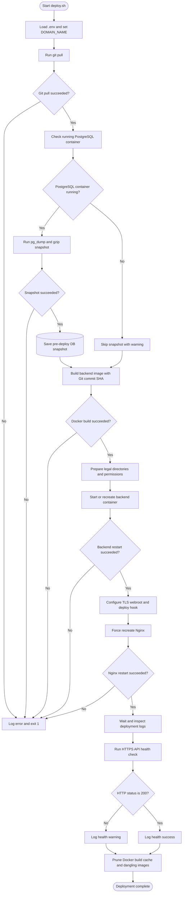

```mermaid
flowchart TD
    A(["Start deploy.sh"]) --> B["Load .env and set DOMAIN_NAME"]
    B --> C["Run git pull"]
    C --> D{"Git pull succeeded?"}
    D -->|No| E["Log error and exit 1"]
    D -->|Yes| F["Check running PostgreSQL container"]

    F --> G{"PostgreSQL container running?"}
    G -->|Yes| H["Run pg_dump and gzip snapshot"]
    H --> I{"Snapshot succeeded?"}
    I -->|No| E
    I -->|Yes| J[("Save pre-deploy DB snapshot")]
    G -->|No| K["Skip snapshot with warning"]

    J --> L["Build backend image with Git commit SHA"]
    K --> L
    L --> M{"Docker build succeeded?"}
    M -->|No| E
    M -->|Yes| N["Prepare legal directories and permissions"]

    N --> O["Start or recreate backend container"]
    O --> P{"Backend restart succeeded?"}
    P -->|No| E
    P -->|Yes| Q["Configure TLS webroot and deploy hook"]

    Q --> R["Force recreate Nginx"]
    R --> S{"Nginx restart succeeded?"}
    S -->|No| E
    S -->|Yes| T["Wait and inspect deployment logs"]

    T --> U["Run HTTPS API health check"]
    U --> V{"HTTP status is 200?"}
    V -->|No| W["Log health warning"]
    V -->|Yes| X["Log health success"]
    W --> Y["Prune Docker build cache and dangling images"]
    X --> Y
    Y --> Z(["Deployment complete"])
```