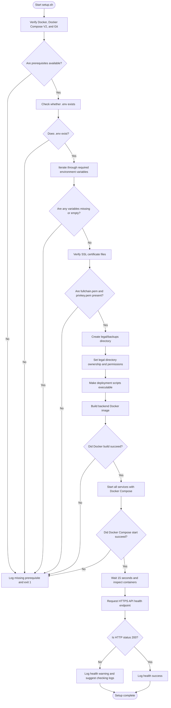

```mermaid
flowchart TD
    A(["Start setup.sh"]) --> B["Verify Docker, Docker Compose V2, and Git"]
    B --> C{"Are prerequisites available?"}
    C -->|No| X["Log missing prerequisite and exit 1"]
    C -->|Yes| D["Check whether .env exists"]

    D --> E{"Does .env exist?"}
    E -->|No| X
    E -->|Yes| F["Iterate through required environment variables"]
    F --> G{"Are any variables missing or empty?"}
    G -->|Yes| X
    G -->|No| H["Verify SSL certificate files"]

    H --> I{"Are fullchain.pem and privkey.pem present?"}
    I -->|No| X
    I -->|Yes| J["Create legal/backups directory"]
    J --> K["Set legal directory ownership and permissions"]
    K --> L["Make deployment scripts executable"]

    L --> M["Build backend Docker image"]
    M --> N{"Did Docker build succeed?"}
    N -->|No| X
    N -->|Yes| O["Start all services with Docker Compose"]

    O --> P{"Did Docker Compose start succeed?"}
    P -->|No| X
    P -->|Yes| Q["Wait 15 seconds and inspect containers"]
    Q --> R["Request HTTPS API health endpoint"]

    R --> S{"Is HTTP status 200?"}
    S -->|No| T["Log health warning and suggest checking logs"]
    S -->|Yes| U["Log health success"]
    T --> V(["Setup complete"])
    U --> V
```