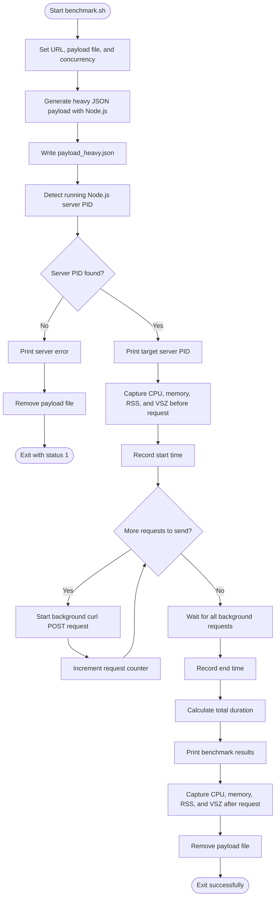

```mermaid
flowchart TD
    A(["Start benchmark.sh"]) --> B["Set URL, payload file, and concurrency"]
    B --> C["Generate heavy JSON payload with Node.js"]
    C --> D["Write payload_heavy.json"]
    D --> E["Detect running Node.js server PID"]

    E --> F{"Server PID found?"}
    F -->|No| G["Print server error"]
    G --> H["Remove payload file"]
    H --> I(["Exit with status 1"])

    F -->|Yes| J["Print target server PID"]
    J --> K["Capture CPU, memory, RSS, and VSZ before request"]
    K --> L["Record start time"]

    L --> M{"More requests to send?"}
    M -->|Yes| N["Start background curl POST request"]
    N --> O["Increment request counter"]
    O --> M

    M -->|No| P["Wait for all background requests"]
    P --> Q["Record end time"]
    Q --> R["Calculate total duration"]
    R --> S["Print benchmark results"]
    S --> T["Capture CPU, memory, RSS, and VSZ after request"]
    T --> U["Remove payload file"]
    U --> V(["Exit successfully"])
```