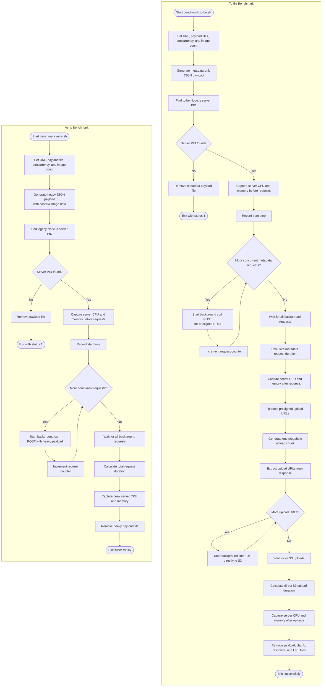

```mermaid
flowchart LR
    subgraph ASIS["As-Is Benchmark"]
    direction TB
        A0(["Start benchmark.as-is.sh"]) --> A1["Set URL, payload file, concurrency, and image count"]
        A1 --> A2["Generate heavy JSON payload<br/>with base64 image data"]
        A2 --> A3["Find legacy Node.js server PID"]
        A3 --> A4{"Server PID found?"}
        A4 -->|No| A5["Remove payload file"]
        A5 --> A6(["Exit with status 1"])
        A4 -->|Yes| A7["Capture server CPU and memory before requests"]
        A7 --> A8["Record start time"]
        A8 --> A9{"More concurrent requests?"}
        A9 -->|Yes| A10["Start background curl POST with heavy payload"]
        A10 --> A11["Increment request<br/>counter"]
        A11 --> A9
        A9 -->|No| A12["Wait for all background requests"]
        A12 --> A13["Calculate total request duration"]
        A13 --> A14["Capture peak server CPU and memory"]
        A14 --> A15["Remove heavy payload file"]
        A15 --> A16(["Exit successfully"])
    end

    subgraph TOBE["To-Be Benchmark"]
        direction TB
        B0(["Start benchmark.to-be.sh"]) --> B1["Set URL, payload files, concurrency, and image count"]
        B1 --> B2["Generate metadata-only<br/>JSON payload"]
        B2 --> B3["Find to-be Node.js server PID"]
        B3 --> B4{"Server PID found?"}
        B4 -->|No| B5["Remove metadata payload file"]
        B5 --> B6(["Exit with status 1"])
        B4 -->|Yes| B7["Capture server CPU and memory before requests"]
        B7 --> B8["Record start time"]
        B8 --> B9{"More concurrent metadata requests?"}
        B9 -->|Yes| B10["Start background curl POST<br/>for presigned URLs"]
        B10 --> B11["Increment request counter"]
        B11 --> B9
        B9 -->|No| B12["Wait for all background requests"]
        B12 --> B13["Calculate metadata request duration"]
        B13 --> B14["Capture server CPU and memory after requests"]
        B14 --> B15["Request presigned upload URLs"]
        B15 --> B16["Generate one megabyte<br/>upload chunk"]
        B16 --> B17["Extract upload URLs from response"]
        B17 --> B18{"More upload URLs?"}
        B18 -->|Yes| B19["Start background curl PUT directly to S3"]
        B19 --> B18
        B18 -->|No| B20["Wait for all S3 uploads"]
        B20 --> B21["Calculate direct S3 upload duration"]
        B21 --> B22["Capture server CPU and memory after uploads"]
        B22 --> B23["Remove payload, chunk, response, and URL files"]
        B23 --> B24(["Exit successfully"])
    end

    ASIS ~~~ TOBE
```