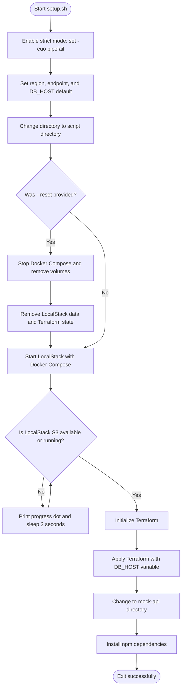

```mermaid
flowchart TD
    A(["Start setup.sh"]) --> B["Enable strict mode: set -euo pipefail"]
    B --> C["Set region, endpoint, and DB_HOST default"]
    C --> D["Change directory to script directory"]
    D --> E{"Was --reset provided?"}

    E -->|Yes| F["Stop Docker Compose and remove volumes"]
    F --> G["Remove LocalStack data and Terraform state"]
    G --> H["Start LocalStack with Docker Compose"]

    E -->|No| H
    H --> I{"Is LocalStack S3 available or running?"}

    I -->|No| J["Print progress dot and sleep 2 seconds"]
    J --> I

    I -->|Yes| K["Initialize Terraform"]
    K --> L["Apply Terraform with DB_HOST variable"]
    L --> M["Change to mock-api directory"]
    M --> N["Install npm dependencies"]
    N --> O(["Exit successfully"])
```