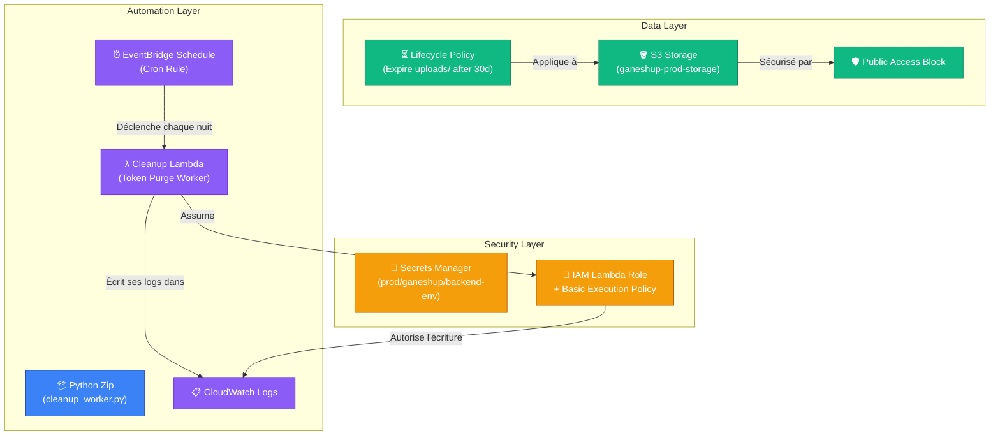

```mermaid
flowchart TD
    classDef tf fill:#3b82f6,stroke:#1e40af,color:white
    classDef data fill:#10b981,stroke:#047857,color:white
    classDef security fill:#f59e0b,stroke:#b45309,color:white
    classDef automation fill:#8b5cf6,stroke:#6d28d9,color:white

    subgraph Data["Data Layer"]
        S3["🪣 S3 Storage<br/>(ganeshup-prod-storage)"]:::data
        Lifecycle["⏳ Lifecycle Policy<br/>(Expire uploads/ after 30d)"]:::data
        Access["🛡️ Public Access Block"]:::data
    end

    subgraph Security["Security Layer"]
        Secrets["🔐 Secrets Manager<br/>(prod/ganeshup/backend-env)"]:::security
        Role["👤 IAM Lambda Role<br/>+ Basic Execution Policy"]:::security
    end

    subgraph Automation["Automation Layer"]
        Archive["📦 Python Zip<br/>(cleanup_worker.py)"]:::tf
        Schedule["⏰ EventBridge Schedule<br/>(Cron Rule)"]:::automation
        Cleanup["λ Cleanup Lambda<br/>(Token Purge Worker)"]:::automation
        Logs["📋 CloudWatch Logs"]:::automation
    end

    Lifecycle -->|Applique à| S3
    S3 -->|Sécurisé par| Access

    Schedule -->|Déclenche chaque nuit| Cleanup
    Cleanup -->|Assume| Role
    Cleanup -->|Écrit ses logs dans| Logs
    Role -->|Autorise l'écriture| Logs
```